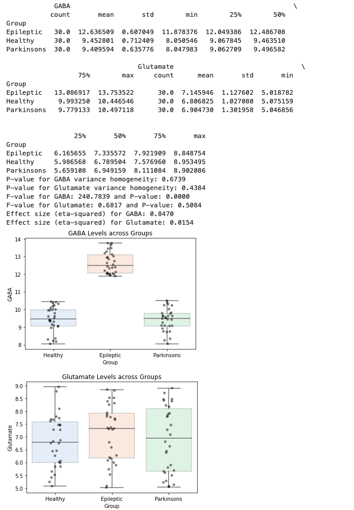
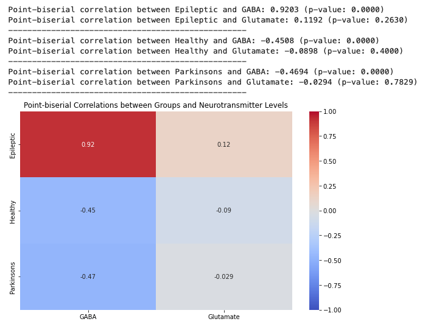

# MR Spectroscopy Analysis of GABA and Glutamate Levels in Relation to Epileptic Drugs

## Introduction:

### 1. MR Spectroscopy:
Magnetic Resonance (MR) Spectroscopy is a non-invasive diagnostic technique that uses MR imaging to capture detailed molecular information of tissues. Unlike traditional MRI, which provides images of anatomy, MR Spectroscopy provides a graph or spectrum of MR signals, revealing information about the number and type of chemical groups in a sample. This technique is particularly valuable for detecting changes in brain chemistry.

### 2. GABA and Glutamate:
**GABA (Gamma-Aminobutyric Acid):** This is the primary inhibitory neurotransmitter in the brain, which means it helps to slow down neuron firing. It plays a crucial role in controlling brain activity and muscle tone. An imbalance in GABA levels is often linked to conditions like anxiety, depression, and certain neurological disorders.

**Glutamate:** This is the primary excitatory neurotransmitter, responsible for sending signals between nerve cells, and under normal conditions, it plays an essential role in learning and memory. However, excessive glutamate release or inadequate uptake can lead to a condition called excitotoxicity, damaging nerve cells.

### 3. Anti-Epileptic Drugs:
Anti-Epileptic drugs (AEDs), are medications prescribed to control seizures (e.g., Topiramate). These drugs primarily act by altering the activity of neurotransmitters in the brain, either by enhancing the effects of inhibitory neurotransmitters like GABA or by reducing the effects of excitatory neurotransmitters like glutamate. Adjusting the balance between excitatory and inhibitory neurotransmitters can help control or prevent epileptic seizures.

## Data Description:

The dataset consists of measurements related to the levels of GABA and Glutamate in the brains of subjects across three distinct groups:

1. **Epileptic (30 subjects):** Individuals diagnosed with epilepsy and are on epileptic drugs.

2. **Healthy (30 subjects):** Individuals with no known neurological disorders serving as a control group.

3. **Parkinson's (30 subjects):** Individuals diagnosed with Parkinson's disease. This group provides an interesting comparison point, as Parkinson's is a neurological disorder, but is distinct from epilepsy.

### Data Features:

- **GABA:** The dataset provides the count, mean, standard deviation, minimum, 25th percentile, median, 75th percentile, and maximum values of GABA levels for each group. GABA, as previously mentioned, is an inhibitory neurotransmitter, and its levels can be influenced by various factors, including the intake of epileptic drugs.

- **Glutamate:** Similar to GABA, the dataset provides detailed statistical measures (count, mean, standard deviation, and percentiles) of Glutamate levels for each group. As the primary excitatory neurotransmitter, it's crucial to study its levels in conjunction with GABA, especially in the context of neurological disorders and their treatment.

## The Code:

My code aims to analyse the levels of GABA and Glutamate in three groups: Epileptic, Healthy, and Parkinson's. By doing so, we can understand the differences in these neurotransmitter levels across groups and possibly, how epileptic drugs influence these levels.

### Key Functions and Their Descriptions:

1. **`generate_data()`:** This function simulates data for our study. In a real-world application, data would be collected from patients and healthy controls using MR Spectroscopy, but for our purposes, synthetic data provides a controlled environment for analysis.

2. **`levenshtein_p_value()`:** Used to test the homogeneity of variance across groups. It's essential to check this assumption before performing an ANOVA, as equal variances across groups ensure the test's validity.

3. **`eta_squared()`:** A function to calculate the effect size in ANOVA. Effect size quantifies the size of the difference between groups, and in the context of ANOVA, the eta-squared value gives the proportion of the total variance in the dependent variable that is attributed to the variance in the independent variable.

4. **`point_biserial_corr()`:** Calculates the point-biserial correlation coefficient. This measure is used to describe the strength and direction of the association between a continuous and a binary variable.

### Workflow:

1. **Data Generation:** Simulates data for 90 subjects, divided equally into three groups. The synthetic data reflects neurotransmitter levels as measured by MR Spectroscopy.
   
2. **ANOVA:** Tests for differences in neurotransmitter levels across groups. Given the three groups under study, ANOVA helps determine if at least two groups are significantly different from each other.

3. **Effect Size Calculation:** After ANOVA, effect size (eta-squared) quantifies the magnitude of the observed differences. 

4. **Correlation Analysis:** Using the point-biserial correlation, the code investigates the relationship between group membership and neurotransmitter levels.

### Output:

### interpretation

## Homogeneity of Variance:
The p-values for GABA and Glutamate variance homogeneity tests are 0.6739 and 0.4384 respectively. Both are greater than a typical alpha level (e.g., 0.05), suggesting that we fail to reject the null hypothesis. This means the variances in the three groups are approximately equal for both GABA and Glutamate, making the conditions for ANOVA valid.

### ANOVA Results:
1. **GABA**: 
   - There is a highly significant difference in GABA levels across the groups with an F-value of 240.78 and a p-value close to 0.
   - The effect size (η²) is 0.8470, which indicates a very strong effect. In context, about 84.7% of the variance in GABA levels can be explained by the group differences.
2. **Glutamate**: 
   - There's no statistically significant difference in Glutamate levels across the groups with a p-value of 0.5084. 
   - The effect size (η²) for Glutamate is 0.0154, suggesting a very small effect, further indicating that group differences aren't pronounced when it comes to Glutamate levels.

### Point-biserial Correlation Results:
1. **Epileptic**: 
   - A very strong positive correlation with GABA levels (r = 0.9203, p < 0.0001), suggesting that as the likelihood of being in the epileptic group increases, GABA levels also increase.
   - There's a weak positive correlation with Glutamate that isn't statistically significant (r = 0.1192, p = 0.2630).
2. **Healthy**: 
   - A moderate negative correlation with GABA levels (r = -0.4508, p < 0.0001). As the likelihood of being in the healthy group increases, GABA levels decrease.
   - A weak negative correlation with Glutamate that isn't statistically significant (r = -0.0898, p = 0.4000).
3. **Parkinson's**: 
   - A moderate negative correlation with GABA levels (r = -0.4694, p < 0.0001). As the likelihood of being in the Parkinson's group increases, GABA levels decrease.
   - A very weak and statistically non-significant correlation with Glutamate (r = -0.0294, p = 0.7829).

### Interpretation:
The results suggest that the GABA levels differ significantly among the groups, especially between the epileptic group and the other two groups. The effect is strong, and given the high point-biserial correlation for the epileptic group, it's evident that being in the epileptic group is associated with increased GABA levels.

On the other hand, Glutamate doesn't show any significant differences across the groups.

*Note: This is not a real dataset. This code is a good framework for statistical analysis, but the interpretation in a real-world scenario would require more contextual information and domain-specific knowledge.

Remy Cohan, 2023
